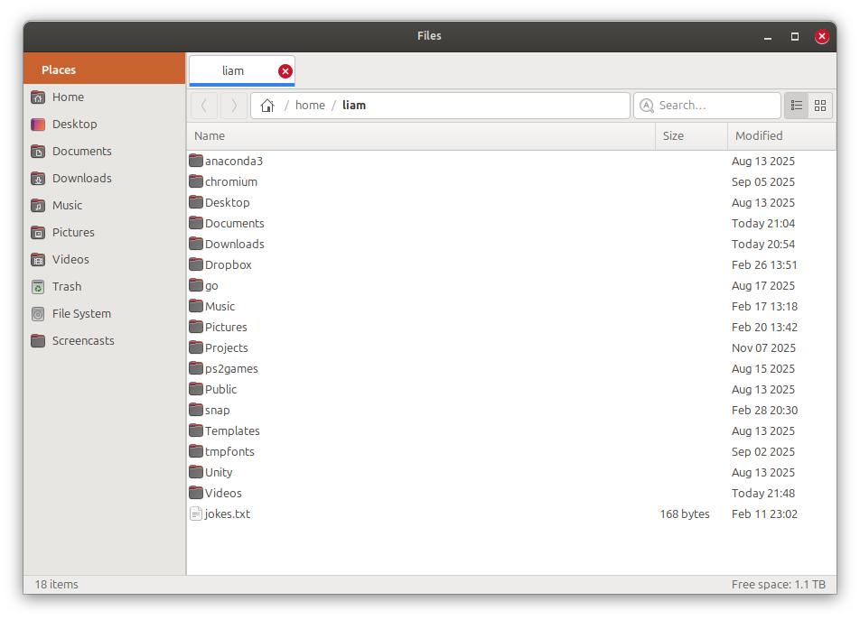

# Filex

A GTK3 file manager for Linux inspired by Ubuntu's Nautilus circa 2012, built with Go.



## Features

- **Classic Ambiance theme** — faithful recreation of the Ubuntu ~2012 look and feel
- **Tabbed browsing** — open multiple directories in tabs, each with independent history
- **Dual view modes** — switch between detailed list view and icon grid view
- **Breadcrumb navigation** — click path segments to jump directly, or toggle to a text entry for manual paths
- **Places sidebar** — quick access to Home, Desktop, Documents, Downloads, and other common directories
- **Bookmark support** — pin your own folders to the sidebar, persisted across sessions
- **Trash management** — move files to trash and restore them, following the freedesktop.org spec
- **File operations** — copy, cut, paste, rename, delete, and create new folders
- **Search** — filter files in the current directory
- **Keyboard shortcuts** — navigate and manage files without leaving the keyboard
- **Status bar** — item count and free disk space at a glance

## Install

### Ubuntu (PPA)

```bash
sudo add-apt-repository ppa:liamzebedee/filex
sudo apt update
sudo apt install filex
```

### Build from source

```bash
git clone https://github.com/liamzebedee/filex.git
cd filex
make build
sudo make install
```
